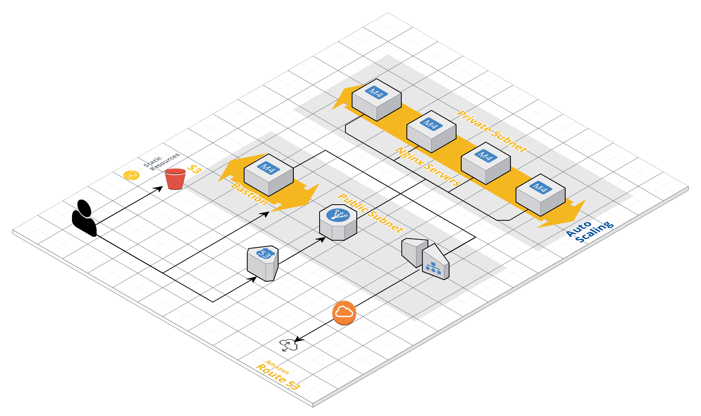

infra base quick start
======================

Local configuration
-------------------

Requirements :
~~~~~~~~~~~~~~

-  Docker
-  Bash
-  An AWS account
-  All the dependencies listed in the Docker image (that you can use
   directly)

Docker environment :
~~~~~~~~~~~~~~~~~~~~

You can create a container to ensure you have all the correct softwares
and dependencies to work with the project, just by typing :

::

   ./workstation/launch.sh

And congratulations ! you have your workstation ready for work.

Project setup
-------------

Set your naming conventions :
~~~~~~~~~~~~~~~~~~~~~~~~~~~~~

To set the configuration for your account,

There is an example of configuration here :

::

   configs
   └── mygroup
       └── myenv
           ├── ssh
           │   └── README.md
           ├── ansible
           └── terraform
               ├── commons.tfvars
               ├── layer-01-networking.tfvars
               └── layer-02-nginx.tfvars

To adapt to your own account and set your own values,

just copy paste the folder “mygroup”, and change the names of the
folders :

-  mygroup : is a logical entity that represent your context (for instance : “mycompany”)
-  myenv : is the iteration of the infrastructure dedicated to a purpose (for instance : “dev”, “staging” or “prod”)

Ansible configuration:
----------------------

-  First,we install Nginx Role :

::

   ansible-galaxy install mehdi_wsc.nginx -p ./ansible/roles/external/

-  Second,We specify ansible configuration for the environnement:

::

   export ANSIBLE_CONFIG="$PWD/<mygroup>-<myenv>-ansible.cfg"

Build Infrastructure :
----------------------

-  Run bootstrap script:

::

   python -m mypackage_wsc.infra_bootstrap --provider aws --account < mygroup >-< myenv >

Run Build-infra script:

::

   python -m mypackage_wsc.infra_builder_terraform --account < mygroup >-< myenv >

And Voilà, you have created an infrastructure in your aws account !

Ansible Nginx deployment :
~~~~~~~~~~~~~~~~~~~~~~~~~~

Now the final step is to install nginx:

::

   python -m mypackage_wsc.install_nginx --group < mygroup > --env < myenv >

At this point, you can access to your public instance with http and you
will view Nginx server page.

-  Hence , the final architecture is:

